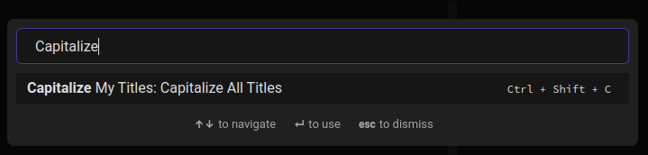
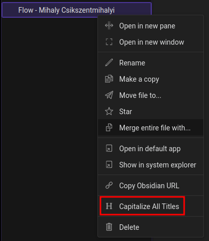
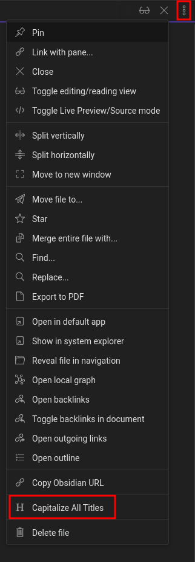

# Capitalize My Titles - Obsidian Plugin

This plugin automatically capitalizes the titles in Markdown files.

## How to Use

There is currently a single command available that capitalizes all titles in a given Markdown file. It can be accessed in different ways.

One way is to use the dedicated keyboard shortcut while a Markdown file is open in the active editor. The default shortcut is **Ctrl+Shift+C** (or **Cmd+Shift+C** on Mac), but can be changed in the *Hotkeys* settings.

Another way is through the *Command Palette*, that can be brought up by pressing **Ctrl+P** (or **Cmd+P** on Mac). Then, search for 'Capitalize My Titles' to bring up all the commands offered by the plugin. Click on the 'capitalize All Titles' command while a Markdown file is open in the active editor to activate it.

The command is also available when right-clicking on a Markdown file in your *Vault*.

Finally, it can be accessed through the *Editor Menu* present at the top-right of your editor.

## Implementation

The capitalization of strings is handled by this library: https://github.com/gouch/to-title-case. If you have any questions or comments about the transformation of titles, please refer to their repository.

## Maintenance and Contribution

This is a very simple plugin, so I don't expect to be much demand for new features.

However, if you have an idea for a feature or want to report a bug, please feel free to [open a new issue](https://github.com/joss-enet/obsidian-capitalize-my-titles/issues). You are also welcome to [perform pull requests](https://github.com/joss-enet/obsidian-capitalize-my-titles/pulls).

This repository adheres to [Conventional Commits](https://www.conventionalcommits.org/en/v1.0.0/) as well as [Semantic Versioning](https://semver.org/).